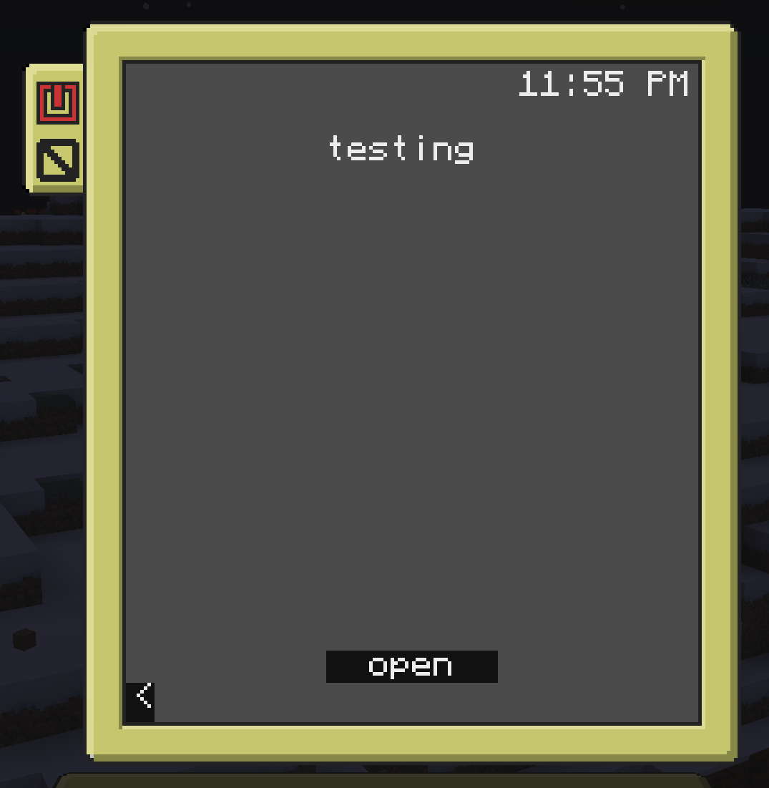
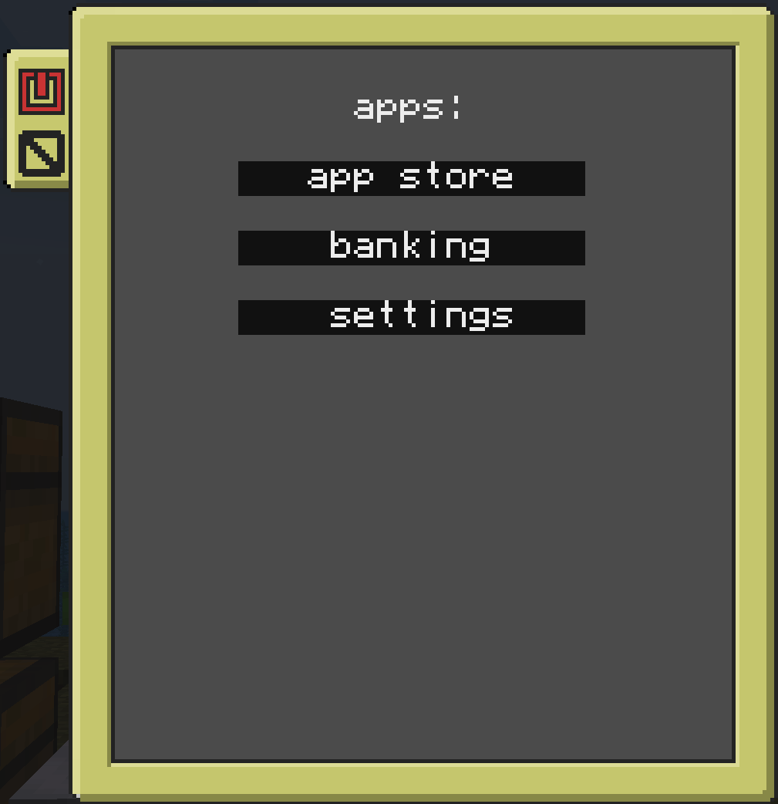
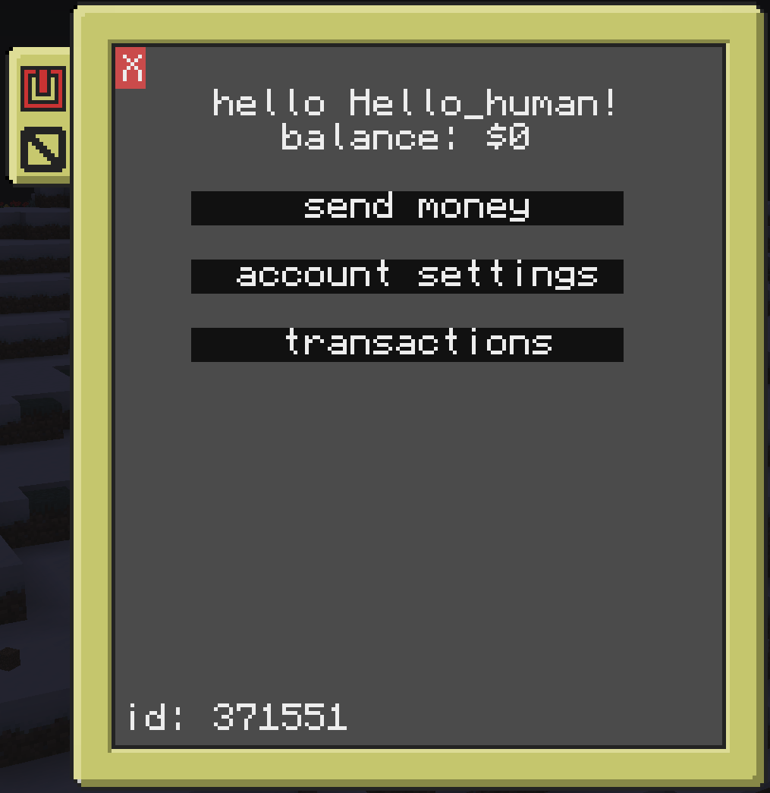

# ccDevice
An expandable device system in computer craft. creating apps is below the images. now updated to use websockets instead of an in game server.

# setup
## client
to install just run the below code on the device, it will bring you through the steps.
```
wget https://raw.githubusercontent.com/popcornman209/ccDevice/main/install.lua
install.lua
```
run this script and it should bring you through the install process, you need a running server to connect to to complete it.<br />
as for the server setup, just clone the server/ directory and run server.py
## server
to install on the server, clone this git
```
git clone https://github.com/popcornman209/ccDevice.git
cd ccDevice
```
then if you want, create a venv
```
python -m venv venv
source venv/bin/activate
```
install requirements
```
pip install -r requirements.txt
```
and run the server
```
cd server/
python server.py
```

# photos




# creating an app
### server side
files/ is just the phones filesystem, so it will look the same as it.<br />
programs/ is for updating, its all the related files, and the version. the phone will check if there is a newer version and auto update.<br />
logs/ when the server encounters an error, it will output it and a traceback into this folder.<br />
documentation/ for different modules/other things documentation.<br />
modules/ is where the server modules go, this is checked by the server and implimented.<br />
moduleFiles/store/ is for the app store<br />
moduleFiles/bank/ is all bank accounts<br />

### phones
apps/ is how the phone lists all apps in the main apps menu<br />
data/ is for anything you need to save, bank accounts, color choices, anything settings wise for the most part<br />
files/ is where all lua files are, and files/settings/ is for any of the settings menus<br />
settingData/ is for any custom settings menu you make for your app, its the same as apps/ but displays in the settings app<br />
uninstall/ is the uninstall scripts, its just a list of any files the phone should delete if you want to uninstall your app.<br />

# examples of files
## client side
### apps/
```
{
  name = "display name",
  file = "files/fileToRun.lua",
  id = "serverSideID",
  version = "1.0.0",
}
```
the file is what will run when you open the app<br />
id is the id used by the app pretty much everywhere, its used for updating. same with the version variable

### settingData/
```
{
  name = "display name",
  file = "files/settings/fileToRun.lua",
}
```
this is basically the same as the apps/ file, just missing all the updating as this should update with the app.

### uninstall/
```
{
    name = "banking",
    files = {
        "files/fileToRun.lua",
        "apps/Example",
        "uninstall/Example",
    },
}
```
the name is display name, and files is a list of any and all files related to this app that should be uninstalled with it.
